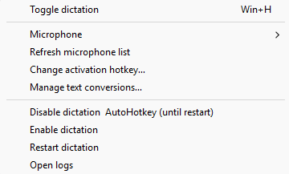

<h1 align="center">Breezy Local Streaming Dictation</h1>

<p align="center"><strong>Fast, accurate, private voice typing that keeps pace with the conversation in your head.</strong></p>

<p align="center">
  <a href="#what-you-need"></a>
  <a href="#privacy"></a>
  <a href="#what-you-need"></a>
  <a href="LICENSE"></a>
</p>

---


## Why I made it

The dictation tools I found either came with another subscription or made me record first and wait for the result. Built-in Windows dictation also missed too many words, especially names and technical terms. In side-by-side tests using the same spoken phrase, the WhisperLiveKit dictation model made far fewer mistakes. I wanted that accuracy in something local that put words on screen while I spoke, let me keep typing, understood punctuation, and learned my vocabulary through corrections I control.

<br clear="left">

<table>
  <tr>
    <td width="50%">
      <strong>⚡ Live text</strong><br>
      See words appear as you speak instead of waiting for a recording to finish.
    </td>
    <td width="50%">
      <strong>⌨️ Type and talk</strong><br>
      Keep using the keyboard while dictated text arrives in the same field.
    </td>
  </tr>
  <tr>
    <td width="50%">
      <strong>🔒 Private by default</strong><br>
      Process microphone audio locally instead of sending recordings to a service.
    </td>
    <td width="50%">
      <strong>✍️ Your vocabulary</strong><br>
      Correct names, terminology, and recurring phrases with personal rules.
    </td>
  </tr>
</table>

## Performance

WhisperLiveKit's default `large-v3-turbo` model is the reason this feels both quick and accurate:
it offers excellent transcription quality without the slower pace of the full
large model. If your GPU has less available memory, setup also accepts smaller
English models.

| Model and approximate VRAM | What to expect |
|---|---|
| **`large-v3-turbo`** — default, 6 GB | Excellent quality with fast transcription |
| **`medium.en`** — 5 GB | High English accuracy with slower transcription |
| **`small.en`** — 2 GB | A strong balance for limited hardware |
| **`base.en`** — 1 GB | Faster and lighter, with a larger accuracy tradeoff |

Memory figures are approximate and real usage varies by hardware. See the
[WhisperLiveKit model guide](https://github.com/QuentinFuxa/WhisperLiveKit/blob/main/docs/default_and_custom_models.md)
for the upstream model comparisons.

## Start in four steps

> [!TIP]
> Preview the installation first. Dry run makes no changes to your computer.

1. Download or extract this project to a local folder.
2. Open PowerShell in that folder.
3. Preview setup:

   ```powershell
   powershell -ExecutionPolicy Bypass -File .\setup.ps1 -DryRun
   ```

4. Install when you are ready:

   ```powershell
   powershell -ExecutionPolicy Bypass -File .\setup.ps1
   ```

Setup guides you through the install location, model storage, compute mode, microphone,
and startup preference. The activation hotkey starts as `Win+H` and can be changed from
the tray. Running setup again keeps your text conversions intact.

## Your first sentence

Choose a microphone from the tray, focus an editable text field, and press your
selected activation hotkey (`Win+H` by default). Speak naturally, then press it again
to finish. The tray icon changes while you are speaking.

## Everyday controls

<table>
  <thead>
    <tr>
      <th>From the tray</th>
      <th>What it does</th>
      <th>Tray menu</th>
    </tr>
  </thead>
  <tbody>
    <tr>
      <td><strong>Microphone</strong></td>
      <td>Switch the active input.</td>
      <td rowspan="6" valign="top"></td>
    </tr>
    <tr>
      <td><strong>Manage text conversions…</strong></td>
      <td>Add personal vocabulary and recurring corrections.</td>
    </tr>
    <tr>
      <td><strong>Change activation hotkey…</strong></td>
      <td>Record a new modifier-plus-key shortcut without typing its name.</td>
    </tr>
    <tr>
      <td><strong>Restart dictation</strong></td>
      <td>Start a fresh dictation session.</td>
    </tr>
    <tr>
      <td><strong>Open logs</strong></td>
      <td>Open local troubleshooting information.</td>
    </tr>
    <tr>
      <td><strong>Disable dictation &amp; AutoHotkey</strong></td>
      <td>Turn dictation off until the next logon.</td>
    </tr>
  </tbody>
</table>

### Personal text conversions

Tell dictation what you expect to say and what should appear instead. You can choose
whether capitalization matters and whether the phrase must appear as separate words.
Changes take effect without restarting dictation.

## What you need

| Requirement | Supported setup |
|---|---|
| Operating system | 64-bit Windows 11 |
| GPU | NVIDIA GPU with current drivers |
| Recommended VRAM | 8 GB or more for the default model |
| Runtime | Python 3.12 with Tcl/Tk |
| Hotkey | AutoHotkey v2 |
| Hardware | Working microphone and enough space for the chosen model |

## Privacy

Your microphone audio is processed on your computer. Dictated text and personal
conversion rules stay local. Logs are stored in
`%LOCALAPPDATA%\breezy_local_streaming_dictation\logs`.

<details>
<summary><strong>Common fixes</strong></summary>

| Symptom | Try this |
|---|---|
| No tray icon | Rerun setup and choose **Start dictation now** at the final step. |
| Wrong microphone | Select **Refresh microphone list**, then choose the input again. |
| No text appears | Confirm the destination is editable and focused, then inspect the local logs. |
| CUDA or model error | Update the NVIDIA driver and rerun setup. |
| Hotkey does nothing | Confirm AutoHotkey v2 is installed, then restart dictation. |

</details>

## Uninstall safely

```powershell
powershell -ExecutionPolicy Bypass -File .\setup.ps1 -Uninstall
```

Normal uninstall keeps `text_conversions.json`. Deleting those rules requires the
separate `-DeleteConversions` option and a confirmation that names the file.

## Credits

Released under the [MIT License](LICENSE). This project includes modified source
from `faster-whisper-dictation`; see [Third-party notices](THIRD_PARTY_NOTICES.md).
